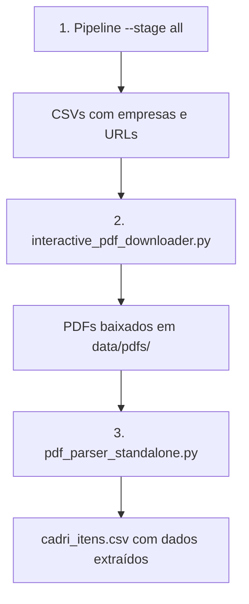

# Planejamento dos Módulos de PDF - CETESB CADRI

## 📋 Sumário
1. [Visão Geral](#visão-geral)
2. [Módulo 1: Interactive PDF Downloader](#módulo-1-interactive-pdf-downloader)
3. [Módulo 2: PDF Parser Standalone](#módulo-2-pdf-parser-standalone)
4. [Fluxo de Execução](#fluxo-de-execução)
5. [Tratamento de Erros](#tratamento-de-erros)
6. [Testes e Validação](#testes-e-validação)
7. [Cronograma de Implementação](#cronograma-de-implementação)

---

## 📊 Visão Geral

### Arquitetura dos Módulos

```
┌─────────────────┐      ┌──────────────────┐      ┌─────────────────┐
│                 │      │                  │      │                 │
│  Pipeline       │─────▶│  CSV Files       │◀─────│  Interactive    │
│  (list+detail)  │      │  - empresas.csv  │      │  PDF Downloader │
│                 │      │  - cadri_docs    │      │                 │
└─────────────────┘      └──────────────────┘      └─────────────────┘
                                  │                          │
                                  │                          ▼
                         ┌──────────────────┐      ┌─────────────────┐
                         │                  │      │                 │
                         │  cadri_itens.csv │◀─────│  PDF Parser     │
                         │                  │      │  Standalone     │
                         └──────────────────┘      └─────────────────┘
```

### Fluxo de Dados

1. **Pipeline** gera CSVs com empresas e URLs de documentos
2. **Interactive PDF Downloader** lê URLs e baixa PDFs via automação
3. **PDF Parser** extrai dados dos PDFs e gera cadri_itens.csv

### Integração com Sistema Existente

- Reutiliza `BrowserManager` de `src/browser.py`
- Usa funções de `store_csv.py` para leitura/escrita
- Aproveita configurações de `config.py`
- Mantém estrutura de logs existente

---

## 🤖 Módulo 1: Interactive PDF Downloader

### 1.1 Requisitos Funcionais

- [x] Ler lista de PDFs pendentes do `cadri_documentos.csv`
- [x] Navegar para URL de autenticidade usando Playwright
- [x] Clicar botão "Consultar" e aguardar processamento
- [x] Clicar botão "Visualize" para download
- [x] Salvar PDF em `data/pdfs/`
- [x] Atualizar status no CSV (pending → downloading → downloaded/failed)
- [x] Implementar retry para falhas
- [x] Rate limiting entre downloads

### 1.2 Estrutura do Código

```python
# interactive_pdf_downloader.py

import asyncio
from pathlib import Path
from typing import Optional, List, Dict
from playwright.async_api import Page, Download
import pandas as pd

from src.browser import BrowserManager
from src.store_csv import get_pending_pdfs, mark_pdf_status
from src.logging_conf import logger
from src.config import PDF_DIR, RATE_MIN, RATE_MAX

class InteractivePDFDownloader:
    """Download PDFs usando automação Playwright"""

    def __init__(self):
        self.browser_manager = BrowserManager()
        self.pdf_dir = PDF_DIR
        self.pdf_dir.mkdir(exist_ok=True)
        self.download_timeout = 30000  # 30 segundos
        self.consultar_wait = 4000  # 4 segundos após clicar Consultar

    async def download_pdf_interactive(
        self,
        url: str,
        numero_documento: str
    ) -> bool:
        """
        Download de um PDF via interação com a página

        Args:
            url: URL de autenticidade do CETESB
            numero_documento: Número do documento para nome do arquivo

        Returns:
            True se sucesso, False se falha
        """
        page = None
        try:
            # 1. Criar nova página
            page = await self.browser_manager.new_page()

            # 2. Configurar download
            download_path = self.pdf_dir / f"{numero_documento}.pdf"
            if download_path.exists():
                logger.info(f"PDF já existe: {numero_documento}")
                mark_pdf_status(numero_documento, 'downloaded')
                return True

            # 3. Navegar para URL
            logger.info(f"Navegando para: {url}")
            await page.goto(url, wait_until='networkidle')

            # 4. Aguardar página carregar
            await page.wait_for_load_state('domcontentloaded')

            # 5. Procurar e clicar botão "Consultar"
            consultar_button = await self._find_consultar_button(page)
            if consultar_button:
                logger.info("Clicando botão 'Consultar'...")
                await consultar_button.click()

                # 6. Aguardar processamento
                logger.info(f"Aguardando {self.consultar_wait}ms...")
                await page.wait_for_timeout(self.consultar_wait)

                # 7. Aguardar seção "Obtenha uma cópia" aparecer
                await page.wait_for_selector(
                    "text=Obtenha uma cópia",
                    timeout=10000
                )

                # 8. Procurar link "Visualize" para PDF
                visualize_link = await self._find_visualize_link(page)
                if visualize_link:
                    logger.info("Clicando em 'Visualize'...")

                    # 9. Preparar para download
                    async with page.expect_download() as download_info:
                        await visualize_link.click()

                    # 10. Processar download
                    download = await download_info.value
                    await download.save_as(download_path)

                    logger.info(f"✅ PDF baixado: {numero_documento}")
                    mark_pdf_status(numero_documento, 'downloaded')
                    return True
                else:
                    logger.error("Link 'Visualize' não encontrado")
                    mark_pdf_status(numero_documento, 'no_visualize_button')
                    return False
            else:
                logger.error("Botão 'Consultar' não encontrado")
                mark_pdf_status(numero_documento, 'no_consultar_button')
                return False

        except Exception as e:
            logger.error(f"Erro no download de {numero_documento}: {e}")
            mark_pdf_status(numero_documento, 'error')
            return False

        finally:
            if page:
                await page.close()

    async def _find_consultar_button(self, page: Page):
        """Localizar botão Consultar com múltiplas estratégias"""
        selectors = [
            "input[type='submit'][value*='Consulte']",
            "input[type='submit'][value*='Consultar']",
            "button:has-text('Consultar')",
            "input[value='Consulte ...']"
        ]

        for selector in selectors:
            try:
                button = await page.query_selector(selector)
                if button:
                    return button
            except:
                continue
        return None

    async def _find_visualize_link(self, page: Page):
        """Localizar link Visualize para PDF"""
        selectors = [
            "a:has-text('Visualize')",
            "a[href*='Adobe']:has-text('Visualize')",
            "td:has-text('Imagem da Licença') ~ td a",
            "a[onclick*='window.open']"
        ]

        for selector in selectors:
            try:
                link = await page.query_selector(selector)
                if link:
                    return link
            except:
                continue
        return None

    async def download_batch(
        self,
        pdf_list: List[Dict[str, str]],
        max_concurrent: int = 1
    ) -> Dict[str, int]:
        """
        Download de múltiplos PDFs

        Args:
            pdf_list: Lista de dicts com 'numero_documento' e 'url_pdf'
            max_concurrent: Downloads simultâneos (padrão 1 para evitar bloqueio)

        Returns:
            Estatísticas do download
        """
        stats = {'success': 0, 'failed': 0, 'skipped': 0}

        for i, pdf_info in enumerate(pdf_list, 1):
            numero = pdf_info['numero_documento']
            url = pdf_info['url_pdf']

            if not url or pd.isna(url):
                logger.warning(f"URL inválida para {numero}")
                stats['skipped'] += 1
                continue

            logger.info(f"[{i}/{len(pdf_list)}] Processando: {numero}")

            success = await self.download_pdf_interactive(url, numero)

            if success:
                stats['success'] += 1
            else:
                stats['failed'] += 1

            # Rate limiting
            if i < len(pdf_list):
                delay = RATE_MIN + (RATE_MAX - RATE_MIN) * 0.5
                logger.info(f"Aguardando {delay:.1f}s antes do próximo...")
                await asyncio.sleep(delay)

        return stats

    async def download_all_pending(self) -> Dict[str, int]:
        """Download de todos os PDFs pendentes"""
        pending = get_pending_pdfs()

        if not pending:
            logger.info("Nenhum PDF pendente para download")
            return {'success': 0, 'failed': 0, 'skipped': 0}

        logger.info(f"📥 {len(pending)} PDFs pendentes para download")

        async with self.browser_manager:
            stats = await self.download_batch(pending)

        logger.info(f"""
        ✅ Downloads concluídos:
           Sucesso: {stats['success']}
           Falhas: {stats['failed']}
           Pulados: {stats['skipped']}
        """)

        return stats


async def main():
    """Função principal"""
    downloader = InteractivePDFDownloader()
    stats = await downloader.download_all_pending()
    return stats

if __name__ == "__main__":
    asyncio.run(main())
```

### 1.3 Configurações (.env)

```bash
# Download Interativo
INTERACTIVE_PDF_ENABLED=true
PDF_CONSULTAR_WAIT_MS=4000
PDF_DOWNLOAD_TIMEOUT_MS=30000
PDF_MAX_CONCURRENT=1
PDF_RETRY_ATTEMPTS=3
```

### 1.4 Tratamento de Estados

| Status | Descrição | Ação |
|--------|-----------|------|
| pending | Aguardando download | Processar |
| downloading | Download em progresso | Skip ou retry |
| downloaded | Download concluído | Skip |
| no_consultar_button | Botão não encontrado | Retry ou manual |
| no_visualize_button | Link não encontrado | Retry ou manual |
| timeout | Timeout no download | Retry |
| error | Erro genérico | Retry |

---

## 📄 Módulo 2: PDF Parser Standalone

### 2.1 Requisitos Funcionais

- [x] Ler PDFs do diretório `data/pdfs/`
- [x] Extrair dados de resíduos (código, descrição, quantidade, unidade)
- [x] Identificar tipo de documento (CADRI, Certificado, etc)
- [x] Salvar dados em `cadri_itens.csv`
- [x] Marcar PDFs como processados
- [x] Validar dados extraídos
- [x] Gerar relatório de parsing

### 2.2 Estrutura do Código

```python
# pdf_parser_standalone.py

import pymupdf
import pandas as pd
import re
from pathlib import Path
from typing import List, Dict, Optional, Tuple
from datetime import datetime

from src.store_csv import CSVStore
from src.logging_conf import logger
from src.config import PDF_DIR, CSV_CADRI_ITEMS

class PDFParserStandalone:
    """Parser de PDFs CADRI"""

    def __init__(self):
        self.pdf_dir = PDF_DIR
        self.patterns = self._compile_patterns()
        self.parsed_cache = self._load_parsed_cache()

    def _compile_patterns(self) -> Dict[str, re.Pattern]:
        """Compilar regex patterns para extração"""
        return {
            # Padrão para código de resíduo
            'codigo': re.compile(
                r'(\d{2}\s?\.\s?\d{2}\s?\.\s?\d{3})',
                re.IGNORECASE
            ),

            # Padrão para quantidade
            'quantidade': re.compile(
                r'(\d+[.,]?\d*)\s*(kg|ton|m3|m³|litro|l|unidade)',
                re.IGNORECASE
            ),

            # Padrão para classe
            'classe': re.compile(
                r'classe\s+(I{1,2}[AB]?|I{3})',
                re.IGNORECASE
            ),

            # Identificar tipo de documento
            'doc_type': re.compile(
                r'(CADRI|Certificado.*Movimentação|Licença)',
                re.IGNORECASE
            ),

            # Data de validade
            'validade': re.compile(
                r'validade.*?(\d{2}[/-]\d{2}[/-]\d{4})',
                re.IGNORECASE
            ),

            # Número do documento
            'numero_doc': re.compile(
                r'n[úº]\s*(\d{5,})',
                re.IGNORECASE
            )
        }

    def _load_parsed_cache(self) -> set:
        """Carregar lista de PDFs já processados"""
        try:
            df = pd.read_csv(CSV_CADRI_ITEMS)
            return set(df['numero_documento'].unique())
        except:
            return set()

    def parse_pdf(self, pdf_path: Path) -> List[Dict]:
        """
        Extrair dados de resíduos de um PDF

        Args:
            pdf_path: Caminho do arquivo PDF

        Returns:
            Lista de itens extraídos
        """
        items = []
        numero_documento = pdf_path.stem

        try:
            # Abrir PDF
            with pymupdf.open(pdf_path) as doc:
                # Extrair texto de todas as páginas
                full_text = ""
                for page in doc:
                    full_text += page.get_text()

                # Identificar tipo de documento
                doc_type = self._identify_doc_type(full_text)

                if not doc_type:
                    logger.warning(f"Tipo de documento não identificado: {numero_documento}")
                    return []

                # Extrair data de validade
                validade = self._extract_date(full_text, 'validade')

                # Procurar tabela de resíduos
                residuos_section = self._find_residuos_section(full_text)

                if residuos_section:
                    # Extrair itens da tabela
                    items = self._extract_residuos_table(
                        residuos_section,
                        numero_documento,
                        doc_type,
                        validade
                    )
                else:
                    # Tentar extração alternativa
                    items = self._extract_residuos_alternative(
                        full_text,
                        numero_documento,
                        doc_type,
                        validade
                    )

                logger.info(f"Extraídos {len(items)} itens de {numero_documento}")

        except Exception as e:
            logger.error(f"Erro ao processar {pdf_path}: {e}")

        return items

    def _identify_doc_type(self, text: str) -> Optional[str]:
        """Identificar tipo de documento"""
        match = self.patterns['doc_type'].search(text)
        if match:
            doc_type = match.group(1).upper()
            # Normalizar
            if 'CADRI' in doc_type:
                return 'CADRI'
            elif 'CERTIFICADO' in doc_type:
                return 'CERT_MOV_RESIDUOS'
            elif 'LICENÇA' in doc_type:
                return 'LICENCA'
        return None

    def _extract_date(self, text: str, date_type: str) -> Optional[str]:
        """Extrair data do texto"""
        if date_type == 'validade':
            match = self.patterns['validade'].search(text)
            if match:
                date_str = match.group(1)
                # Normalizar formato
                date_str = date_str.replace('/', '-')
                try:
                    date_obj = datetime.strptime(date_str, '%d-%m-%Y')
                    return date_obj.strftime('%Y-%m-%d')
                except:
                    return date_str
        return None

    def _find_residuos_section(self, text: str) -> Optional[str]:
        """Localizar seção de resíduos no texto"""
        # Procurar marcadores de início da tabela
        markers = [
            'RESÍDUOS AUTORIZADOS',
            'RELAÇÃO DE RESÍDUOS',
            'RESÍDUOS CLASSE',
            'CÓDIGO.*DESCRIÇÃO.*QUANTIDADE',
            'ITEM.*RESÍDUO.*CLASSE'
        ]

        for marker in markers:
            pattern = re.compile(marker, re.IGNORECASE)
            match = pattern.search(text)
            if match:
                # Retornar texto a partir do marcador
                start_pos = match.start()
                # Pegar próximos 5000 caracteres
                return text[start_pos:start_pos+5000]

        return None

    def _extract_residuos_table(
        self,
        section: str,
        numero_documento: str,
        doc_type: str,
        validade: Optional[str]
    ) -> List[Dict]:
        """Extrair resíduos de uma seção de tabela"""
        items = []

        # Quebrar em linhas
        lines = section.split('\n')

        current_item = {}

        for line in lines:
            line = line.strip()

            if not line:
                # Linha vazia, salvar item se completo
                if current_item.get('codigo') and current_item.get('descricao'):
                    items.append({
                        'numero_documento': numero_documento,
                        'tipo_documento': doc_type,
                        'codigo_residuo': current_item['codigo'],
                        'descricao_residuo': current_item['descricao'],
                        'quantidade': current_item.get('quantidade', ''),
                        'unidade': current_item.get('unidade', ''),
                        'classe': current_item.get('classe', ''),
                        'data_validade': validade,
                        'observacao': current_item.get('obs', ''),
                        'data_extracao': datetime.now().isoformat()
                    })
                    current_item = {}
                continue

            # Procurar código
            codigo_match = self.patterns['codigo'].search(line)
            if codigo_match:
                current_item['codigo'] = codigo_match.group(1).replace(' ', '.')
                # Resto da linha é descrição
                descricao_start = codigo_match.end()
                current_item['descricao'] = line[descricao_start:].strip()

            # Procurar quantidade
            qtd_match = self.patterns['quantidade'].search(line)
            if qtd_match:
                current_item['quantidade'] = qtd_match.group(1)
                current_item['unidade'] = qtd_match.group(2)

            # Procurar classe
            classe_match = self.patterns['classe'].search(line)
            if classe_match:
                current_item['classe'] = classe_match.group(1)

        return items

    def _extract_residuos_alternative(
        self,
        text: str,
        numero_documento: str,
        doc_type: str,
        validade: Optional[str]
    ) -> List[Dict]:
        """Extração alternativa quando não há tabela clara"""
        items = []

        # Procurar todos os códigos de resíduo
        codigos = self.patterns['codigo'].findall(text)

        for codigo in codigos:
            codigo_norm = codigo.replace(' ', '.')

            # Tentar encontrar contexto ao redor do código
            pattern = re.compile(
                rf'{re.escape(codigo)}[^\n]*',
                re.IGNORECASE
            )
            match = pattern.search(text)

            if match:
                context = match.group(0)

                # Extrair descrição (texto após o código)
                descricao = context[len(codigo):].strip()
                descricao = re.sub(r'\s+', ' ', descricao)[:200]

                # Procurar quantidade no contexto
                qtd_match = self.patterns['quantidade'].search(context)
                quantidade = qtd_match.group(1) if qtd_match else ''
                unidade = qtd_match.group(2) if qtd_match else ''

                # Procurar classe
                classe_match = self.patterns['classe'].search(context)
                classe = classe_match.group(1) if classe_match else ''

                items.append({
                    'numero_documento': numero_documento,
                    'tipo_documento': doc_type,
                    'codigo_residuo': codigo_norm,
                    'descricao_residuo': descricao,
                    'quantidade': quantidade,
                    'unidade': unidade,
                    'classe': classe,
                    'data_validade': validade,
                    'observacao': '',
                    'data_extracao': datetime.now().isoformat()
                })

        return items

    def parse_all_pdfs(self) -> Dict[str, int]:
        """Processar todos os PDFs pendentes"""
        stats = {'processed': 0, 'items_extracted': 0, 'errors': 0}

        # Listar PDFs
        pdf_files = list(self.pdf_dir.glob("*.pdf"))

        # Filtrar já processados
        pending = [
            pdf for pdf in pdf_files
            if pdf.stem not in self.parsed_cache
        ]

        if not pending:
            logger.info("Nenhum PDF novo para processar")
            return stats

        logger.info(f"📄 {len(pending)} PDFs para processar")

        all_items = []

        for i, pdf_path in enumerate(pending, 1):
            logger.info(f"[{i}/{len(pending)}] Processando: {pdf_path.name}")

            try:
                items = self.parse_pdf(pdf_path)

                if items:
                    all_items.extend(items)
                    stats['items_extracted'] += len(items)

                stats['processed'] += 1

            except Exception as e:
                logger.error(f"Erro em {pdf_path.name}: {e}")
                stats['errors'] += 1

        # Salvar no CSV
        if all_items:
            df_new = pd.DataFrame(all_items)

            # Carregar existente ou criar novo
            try:
                df_existing = pd.read_csv(CSV_CADRI_ITEMS)
                df_combined = pd.concat([df_existing, df_new], ignore_index=True)
            except:
                df_combined = df_new

            # Remover duplicatas
            df_combined = df_combined.drop_duplicates(
                subset=['numero_documento', 'codigo_residuo'],
                keep='last'
            )

            # Salvar
            df_combined.to_csv(CSV_CADRI_ITEMS, index=False)
            logger.info(f"✅ Salvos {len(all_items)} itens em {CSV_CADRI_ITEMS}")

        logger.info(f"""
        📊 Parsing concluído:
           PDFs processados: {stats['processed']}
           Itens extraídos: {stats['items_extracted']}
           Erros: {stats['errors']}
        """)

        return stats

    def validate_extraction(self, items: List[Dict]) -> List[Dict]:
        """Validar e limpar dados extraídos"""
        validated = []

        for item in items:
            # Validar código
            if not re.match(r'\d{2}\.\d{2}\.\d{3}', item.get('codigo_residuo', '')):
                continue

            # Limpar descrição
            if item.get('descricao_residuo'):
                item['descricao_residuo'] = re.sub(
                    r'\s+', ' ',
                    item['descricao_residuo']
                ).strip()[:500]

            # Normalizar unidade
            unidade = item.get('unidade', '').lower()
            unidade_map = {
                'kg': 'kg',
                'ton': 't',
                't': 't',
                'm3': 'm³',
                'm³': 'm³',
                'l': 'L',
                'litro': 'L',
                'litros': 'L',
                'unidade': 'un',
                'unidades': 'un'
            }
            item['unidade'] = unidade_map.get(unidade, unidade)

            validated.append(item)

        return validated


def main():
    """Função principal"""
    parser = PDFParserStandalone()
    stats = parser.parse_all_pdfs()
    return stats

if __name__ == "__main__":
    main()
```

### 2.3 Schema do CSV de Saída

```python
# cadri_itens.csv
CADRI_ITEMS_COLS = [
    'numero_documento',     # FK para cadri_documentos
    'tipo_documento',       # CADRI, CERT_MOV_RESIDUOS, etc
    'codigo_residuo',       # Ex: 13.01.005
    'descricao_residuo',    # Descrição do resíduo
    'quantidade',           # Valor numérico
    'unidade',             # kg, t, m³, L, un
    'classe',              # I, IIA, IIB, III
    'data_validade',       # YYYY-MM-DD
    'observacao',          # Observações adicionais
    'data_extracao',       # Timestamp da extração
]
```

### 2.4 Estratégias de Extração

1. **Extração Estruturada**: Buscar tabelas com headers específicos
2. **Extração por Padrões**: Usar regex para encontrar códigos e contexto
3. **Extração Híbrida**: Combinar ambas estratégias
4. **Fallback Manual**: Marcar para revisão manual quando falhar

---

## 🔄 Fluxo de Execução

### Sequência Completa



### Comandos de Execução

```bash
# Passo 1: Coleta de dados
python -m src.pipeline --stage all --max-iterations 10

# Passo 2: Download interativo de PDFs
python interactive_pdf_downloader.py

# Passo 3: Parse dos PDFs
python pdf_parser_standalone.py

# Opcional: Verificar status
python check_status.py
```

### Scripts de Monitoramento

```python
# monitor_progress.py
import pandas as pd
from pathlib import Path

def check_progress():
    """Verificar progresso geral do processo"""

    # Empresas
    df_empresas = pd.read_csv('data/csv/empresas.csv')
    print(f"Empresas: {len(df_empresas)}")

    # Documentos
    df_docs = pd.read_csv('data/csv/cadri_documentos.csv')
    print(f"Documentos: {len(df_docs)}")

    # PDFs
    pending = df_docs[df_docs['status_pdf'] != 'downloaded']
    print(f"PDFs pendentes: {len(pending)}")

    pdf_files = list(Path('data/pdfs').glob('*.pdf'))
    print(f"PDFs baixados: {len(pdf_files)}")

    # Itens
    try:
        df_items = pd.read_csv('data/csv/cadri_itens.csv')
        print(f"Itens extraídos: {len(df_items)}")
        print(f"Documentos processados: {df_items['numero_documento'].nunique()}")
    except:
        print("Nenhum item extraído ainda")

if __name__ == "__main__":
    check_progress()
```

---

## 🛡️ Tratamento de Erros

### Cenários de Falha - Download

| Erro | Causa | Solução |
|------|-------|---------|
| Timeout na navegação | Página lenta | Aumentar timeout, retry |
| Botão não encontrado | Mudança no layout | Atualizar seletores |
| Download falhou | Arquivo não disponível | Marcar como indisponível |
| Captcha | Proteção anti-bot | Intervenção manual |
| Rate limit | Muitas requisições | Aumentar delay |

### Cenários de Falha - Parsing

| Erro | Causa | Solução |
|------|-------|---------|
| PDF corrompido | Download incompleto | Re-download |
| Formato não reconhecido | Layout novo | Atualizar patterns |
| Texto não extraível | PDF escaneado | OCR ou manual |
| Dados incompletos | Extração parcial | Log para revisão |

### Sistema de Retry

```python
async def retry_with_backoff(
    func,
    max_attempts=3,
    initial_delay=1.0,
    max_delay=60.0,
    backoff_factor=2.0
):
    """Retry com backoff exponencial"""
    delay = initial_delay

    for attempt in range(max_attempts):
        try:
            return await func()
        except Exception as e:
            if attempt == max_attempts - 1:
                raise

            logger.warning(f"Tentativa {attempt + 1} falhou: {e}")
            logger.info(f"Aguardando {delay}s antes de retry...")

            await asyncio.sleep(delay)
            delay = min(delay * backoff_factor, max_delay)

    raise Exception(f"Falhou após {max_attempts} tentativas")
```

---

## 🧪 Testes e Validação

### Testes Unitários

```python
# test_interactive_downloader.py
import pytest
from unittest.mock import Mock, patch

@pytest.mark.asyncio
async def test_find_consultar_button():
    """Testar localização do botão Consultar"""
    downloader = InteractivePDFDownloader()
    mock_page = Mock()

    # Simular botão encontrado
    mock_page.query_selector.return_value = Mock()

    button = await downloader._find_consultar_button(mock_page)
    assert button is not None

@pytest.mark.asyncio
async def test_download_pdf_already_exists():
    """Testar skip quando PDF já existe"""
    # ... implementação do teste
```

### Testes de Integração

```python
# test_integration.py
import asyncio
from pathlib import Path

async def test_full_flow():
    """Testar fluxo completo com arquivo real"""
    # 1. Pegar uma URL de teste
    test_url = "https://autenticidade.cetesb.sp.gov.br/..."
    test_doc = "12345"

    # 2. Executar download
    downloader = InteractivePDFDownloader()
    success = await downloader.download_pdf_interactive(test_url, test_doc)

    assert success
    assert Path(f"data/pdfs/{test_doc}.pdf").exists()

    # 3. Executar parse
    parser = PDFParserStandalone()
    items = parser.parse_pdf(Path(f"data/pdfs/{test_doc}.pdf"))

    assert len(items) > 0
    assert items[0]['codigo_residuo'] matches pattern
```

### Validação de Dados

```python
def validate_extracted_data():
    """Validar qualidade dos dados extraídos"""
    df = pd.read_csv('data/csv/cadri_itens.csv')

    # Verificar códigos válidos
    valid_codes = df['codigo_residuo'].str.match(r'\d{2}\.\d{2}\.\d{3}')
    print(f"Códigos válidos: {valid_codes.sum()}/{len(df)}")

    # Verificar descrições não vazias
    non_empty_desc = df['descricao_residuo'].notna() & (df['descricao_residuo'] != '')
    print(f"Descrições válidas: {non_empty_desc.sum()}/{len(df)}")

    # Verificar classes válidas
    valid_classes = df['classe'].isin(['I', 'IIA', 'IIB', 'III', ''])
    print(f"Classes válidas: {valid_classes.sum()}/{len(df)}")

    return df
```

---

## 📅 Cronograma de Implementação

### Fase 1: Interactive PDF Downloader (3-4 dias)
- [ ] Dia 1: Estrutura básica e navegação
- [ ] Dia 2: Implementar cliques e downloads
- [ ] Dia 3: Tratamento de erros e retry
- [ ] Dia 4: Testes e refinamentos

### Fase 2: PDF Parser Standalone (2-3 dias)
- [ ] Dia 1: Estrutura e patterns de extração
- [ ] Dia 2: Implementar parsing e validação
- [ ] Dia 3: Testes com PDFs reais

### Fase 3: Integração e Testes (2 dias)
- [ ] Dia 1: Integração completa
- [ ] Dia 2: Testes end-to-end

### Fase 4: Documentação e Deploy (1 dia)
- [ ] Atualizar README
- [ ] Criar guia de uso
- [ ] Scripts de monitoramento

### Dependências
- Playwright instalado e configurado
- pymupdf (fitz) para parsing
- Estrutura de CSVs existente
- Diretórios criados (data/pdfs/)

### Estimativa Total: 8-10 dias

---

## 📝 Notas de Implementação

### Considerações de Performance
- Limitar downloads simultâneos para evitar bloqueio
- Implementar cache de PDFs já processados
- Batch processing para grandes volumes

### Segurança
- Validar URLs antes de navegar
- Sanitizar nomes de arquivos
- Timeout em todas operações

### Manutenibilidade
- Logs detalhados em cada etapa
- Configurações externalizadas
- Código modular e testável

### Melhorias Futuras
- Suporte a OCR para PDFs escaneados
- Interface web para monitoramento
- Processamento paralelo de parsing
- Machine Learning para melhorar extração